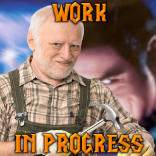

Custom Hero-like map.

## In-game Commands

#### Statistic Board

A multiboard that contains information about players' damage done and kills

Command | Short | Purpose
--- | --- | ---
-ResetStatistic | -rs | sets the statistic board's values to zero
-ShowTotalStatistic | -sts | shows statistic for the whole game

Command | Purpose
--- | ---
-dmg pre | shows damage taken (AFTER armor and ability reduction) on units as floating text
-dmg post | shows damage dealing (BEFORE armor and ability reduction) on units as floating text
-dmg self | shows only your own damage
-dmg all | shows damage of all players
-dmg hide | disables showing damage as floating text
-dmg show | enables showing damage as floating text

#### Damage Info

Can be used in multiplayer.

Command | Short | Purpose
--- | --- | ---
-ShowDamageInfo | -sdi | the player will receive detailed info about dealing and taken damage
-HideDamageInfo | -hdi | the player won't receive detailed about dealing and taken damage

### Test Mode

Command | Purpose
--- | ---
-TestMode | enables the test mode

The commands below can be used only in the test mode.

#### Base Restoration

Command | Short | Purpose
--- | --- | ---
-DisableBaseRestoration | -dbr | disables health and mana restoration at the base
-EnableBaseRestoration | -ebr | enables health and mana restoration at the base

#### Test Ghoul

Creates N enemy ghouls in TestGhoul rect that can be used to test abilities and items. 

Command | Short | Purpose
--- | --- | ---
-CreateTestGhoul N | -ctg N | creates N enemy ghouls (N can be ommited)
-RemoveTestGhouls | -rtg N | kills N random ghouls
-SetTestGhoulHitPoints N | -stghp N | sets ghouls' amount of hit points to N
-SetTestGhoulArmor N | -stga N | sets ghouls' armor value to N

### Resources

Command | Purpose
--- | ---
-Gold N | sets the player's gold to N
-Lumber N | sets the player's lumber to N

#### Heroes

Command | Short | Purpose
--- | --- | ---
-CreateAllCustomHeroes | -cach | adds all built custom heroes on the map
-CreateCustomHero N | -cch N | adds a built hero on the map by name N (not proper name) (non-case sensitive)
-RemoveCustomHeroes | -rch | removes all the added heroes from the map

Command | Short | Purpose
--- | --- | ---
-DisableAttack | -da | disables attack for the player's hero
-EnableAttack | -ea | enables attack for the player's hero

Command | Short | Purpose
--- | --- | ---
-SetHeroLevel N1 N2 | -shl | set the player's hero's level to N1 and gives him N2 experience points.

Command | Short | Purpose
--- | --- | ---
-Immortal | -imm | the player's units have infinite hp and mana

Command | Purpose
--- | ---
-Revive | revives all dead custom heroes at the base

#### Levels

Command | Short | Purpose
--- | --- | ---
-GoLevel N | -gl N | sends all custom heroes to level N
-ResetLevel N | -rl N | resets level N
-ResetAllLevels | -ral | resets all levels and returns heroes to the base